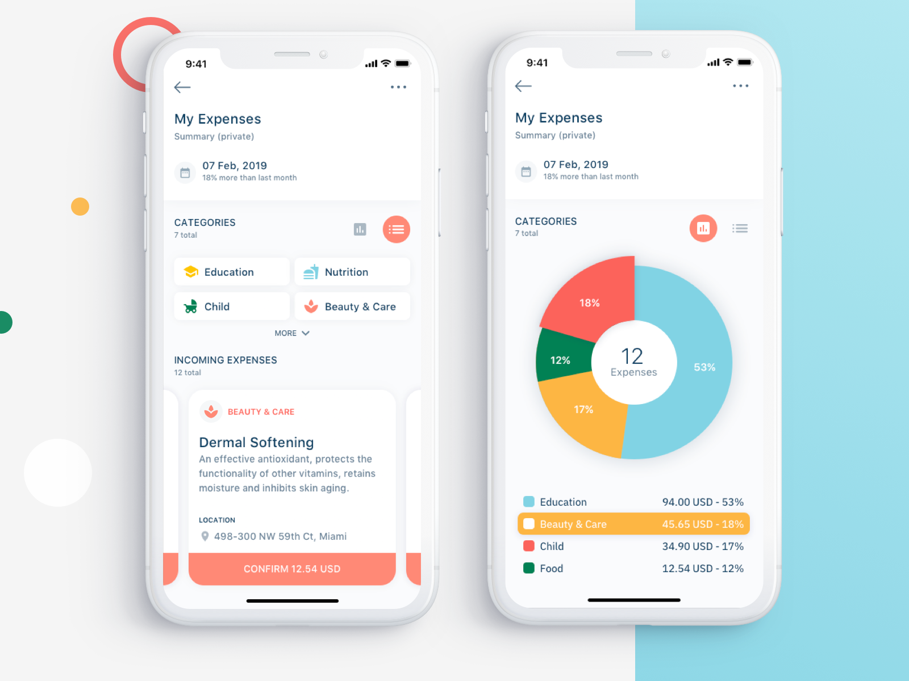

# ExpenseTrackerApp

> A beautiful expense tracking app to help you save money, track expenses and control spend

## User Interface

## Languages

- **Node.js & Express** => _For backend and API design_
- **React Native** => _iOS and Android App_
- **Reactjs** => _For a Web Version_
- **[ToDo]** => _Add TypeScript_
- [Coming Soon] **Flutter** => _iOS and Android Dart Version_

## Contributors

<a href="https://simonielmusyoki.com/">
 Simoniel Musyoki</a>

> Want to contribute? Just do a pull request with your changes. We'll review them and merge them
